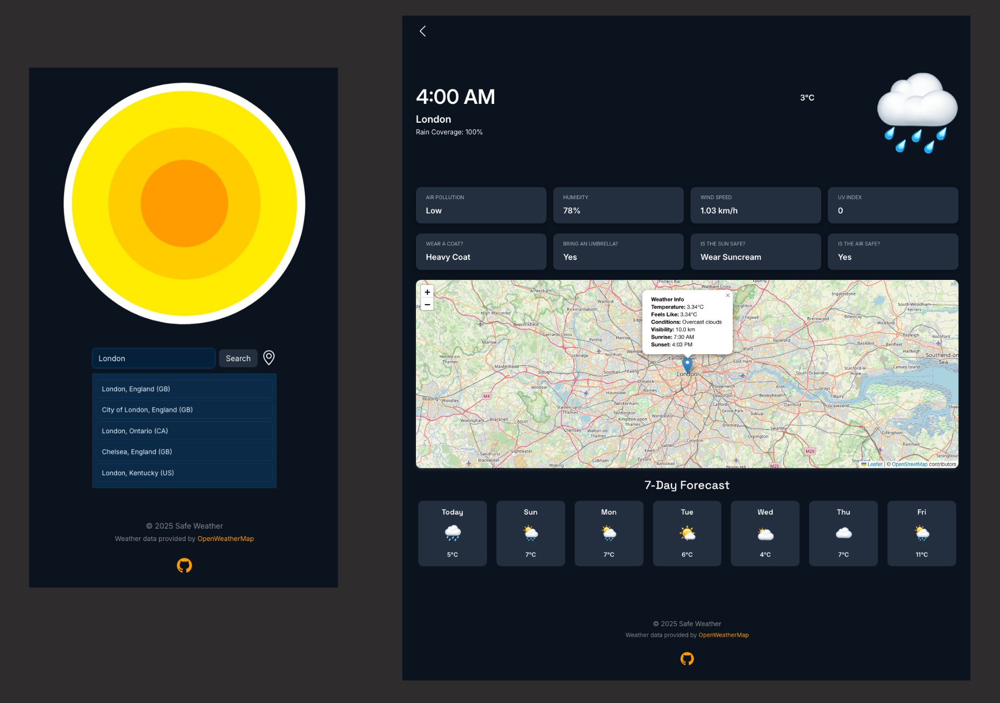
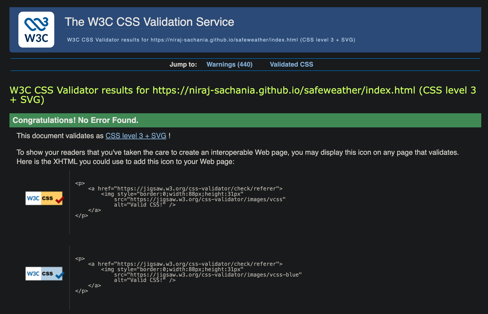
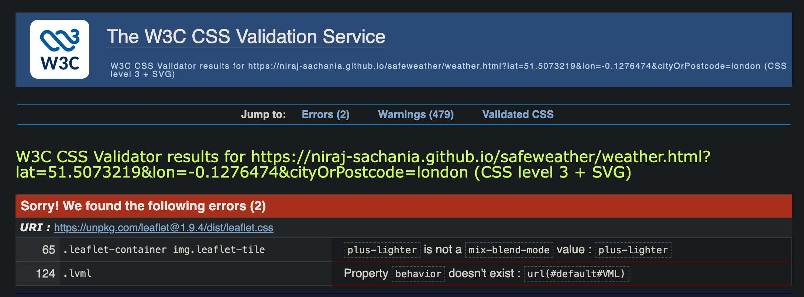
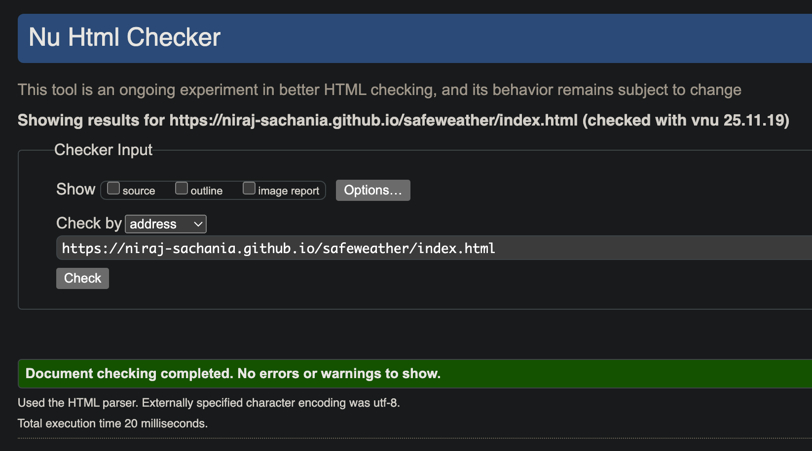
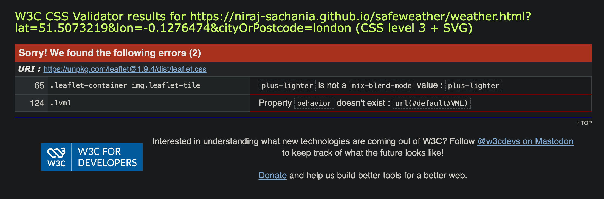
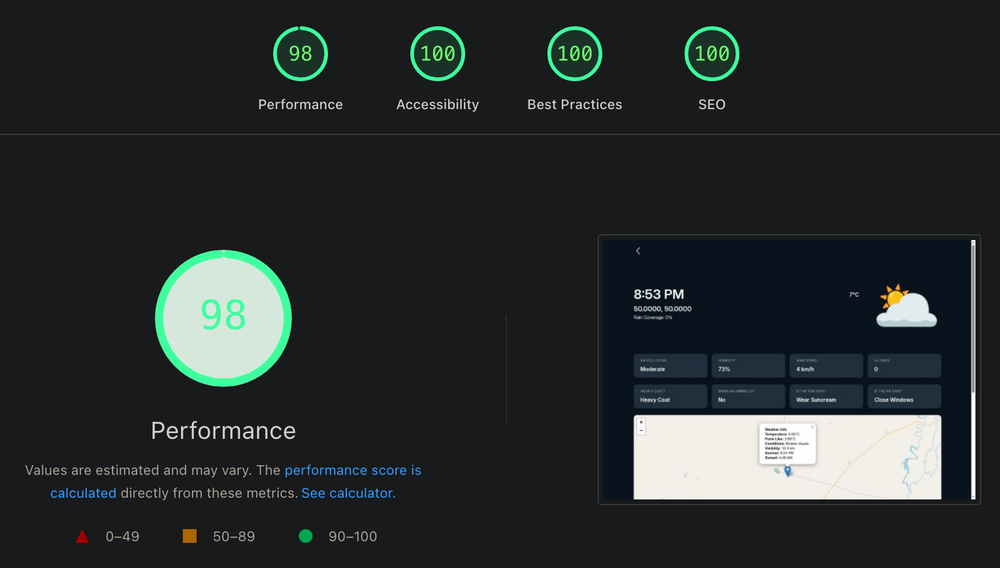
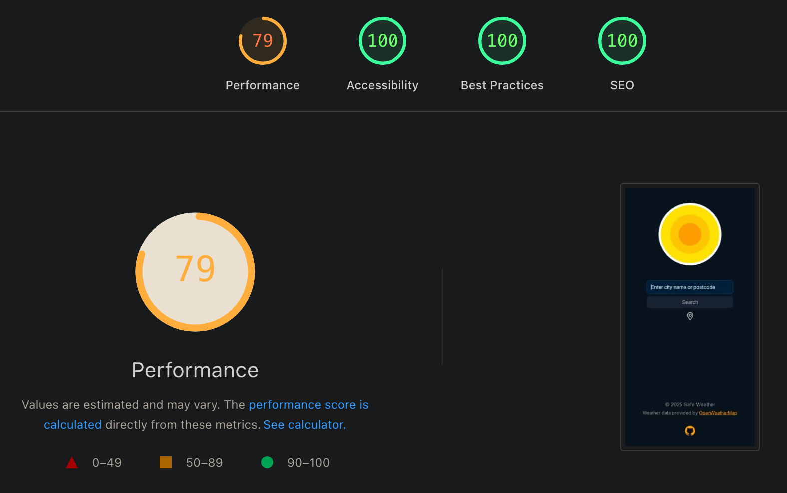
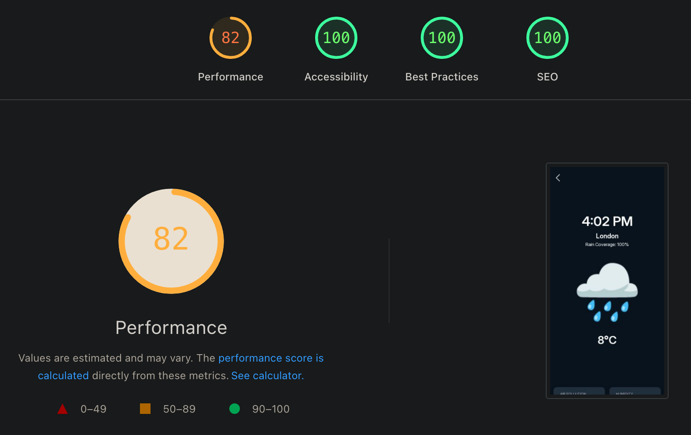

<div align="center">
  
  
  # Safe Weather ☀️🌧️
  
  A real-time weather application that provides intelligent clothing and safety recommendations based on current weather conditions, air quality and UV index.
</div>



**Live Site**: [Github Pages](https://niraj-sachania.github.io/safeweather/) | **User Stories**: [Project Board](https://github.com/users/niraj-sachania/projects/8) | **UX Design**: [Miro Board](https://miro.com/app/board/uXjVJp0Hlv8=/?share_link_id=951899658915)

## Table of Contents

- [Features](#features)
- [Design](#design)
  - [Wireframes](#wireframes)
  - [Colour Palette](#colour-palette)
  - [Responsive Views](#responsive-views)
- [Tech Stack](#tech-stack)
- [Project Structure](#project-structure)
- [Quick Start](#quick-start)
- [Testing](#testing)
  - [Manual Testing](#manual-testing)
  - [Code Validation](#code-validation)
  - [Performance Testing](#performance-testing)
- [AI Augmented Development](#ai-augmented-development)
  - [GitHub Copilot Usage](#github-copilot-usage)
  - [Copilot Agent Exploration](#copilot-agent-exploration)
  - [Impact on Development](#impact-on-development)
- [Team Contributions](#team-contributions)
- [Data Sources](#data-sources)

## Features

- **Real-time Weather Data** - Current temperature, humidity, wind speed and conditions
- **5-Day Forecast** - Extended weather predictions with daily breakdowns
- **Interactive Map** - Leaflet-powered map to explore weather in different locations
- **Smart Recommendations** - Personalised advice on:
  - Coat/jacket requirements based on temperature
  - Umbrella needs based on precipitation probability
  - Sun protection guidance using UV index
  - Air quality alerts and mask recommendations
- **Location Search** - Find weather by city name, postcode or device location
- **Weather Icons** - Visual representation of current conditions
- **Responsive Design** - Mobile-friendly interface using Bootstrap

## Design

### Wireframes

Initial design concepts and user flow:


### Colour Palette

The application uses a carefully selected colour scheme:


### Responsive Views

The application is fully responsive across all device sizes:


## Tech Stack

- **Frontend**: HTML5, CSS3, JavaScript (ES6 modules)
- **Backend**: Proxy server via Netlify serverless function to secure API key
- **Styling**: Bootstrap 5.3.8, custom CSS
- **Mapping**: Leaflet.js 1.9.4
- **Weather API**: OpenWeatherMap
- **Hosting**: GitHub Pages compatible

## Project Structure

```
safeweather/
├── index.html              # Landing page with search
├── weather.html            # Weather details page
├── assets/
│   ├── css/
│   │   └── style.css       # Custom styles
│   ├── images/             # Logo and favicon
│   └── js/
│       ├── weather-data.js           # API calls and data management
│       ├── update-weather-data.js    # DOM updates for weather info
│       ├── update-recomendations.js  # Clothing/safety logic
│       ├── five-day-forecast.js      # Forecast rendering
│       ├── location-search.js        # Search functionality
│       ├── map-init.js               # Leaflet map initialization
│       └── utils/
│           ├── format-date.js        # Date formatting helpers
│           └── weather-icons.js      # Icon mapping
```

## Quick Start

1. Clone the repository:

   ```bash
   git clone https://github.com/niraj-sachania/safeweather.git
   cd safeweather
   ```

2. Start a local server:

   ```bash
   python3 -m http.server
   ```

3. Open your browser to `http://localhost:8000`

## Testing

### Manual Testing

Comprehensive manual testing was performed across all pages and features:

#### Homepage (`index.html`)

- ✅ Search by city name - Successfully retrieves weather data
- ✅ Search by postcode - Accurately locates and displays weather
- ✅ Device location - Geolocation API working correctly
- ✅ Search validation and error handling
- ✅ Invalid search input (e.g. 'aaaa') - Returns "Lookup failed. Please try again."
- ✅ Unique city name (e.g. 'Thrissur') - Takes straight to the weather page
- ✅ Common city name (e.g. 'London') - Prompts user to select which location

#### Weather Page (`weather.html`)

- ✅ Back to home link - Navigation functioning properly
- ✅ Interactive map - Zoom, pan and click events working
- ✅ Weather data - API integration pulling through correctly
- ✅ 5-day forecast - Displaying accurate predictions
- ✅ Smart recommendations - Logic responding to weather conditions

#### Site-wide

- ✅ Footer links - All external links opening correctly
- ✅ Responsive design - Tested across mobile, tablet and desktop
- ✅ Cross-browser compatibility - Verified on Chrome, Firefox, Safari

### Code Validation

#### HTML Validation

All HTML pages pass W3C validation with no errors.

#### CSS Validation




#### HTML Validation




### Performance Testing

Performance testing was conducted using Google PageSpeed Insights:

#### Desktop Performance




#### Mobile Performance




**Note**: Performance scores are impacted by third-party frameworks (Leaflet.js and Bootstrap) which are outside of our control. These dependencies are necessary for the map functionality and responsive design and their performance characteristics affect the overall scores. Our custom code is optimised and follows best practices.

## AI Augmented Development

This project leveraged AI tools extensively throughout the development process, demonstrating how AI can enhance productivity and code quality whilst enabling efficient collaborative workflows.

### GitHub Copilot Usage

GitHub Copilot was integrated throughout the development lifecycle:

- **Documentation Generation** - Generated README markdown from supplied content
- **Code Understanding** - Explained complex code sections and API integrations
- **Code Formatting** - Maintained consistent code style across the project
- **Auto-suggestions** - Provided intelligent code completions during development
- **Boilerplate Generation** - Accelerated development with template code
- **Project Planning** - Generated and refined user stories and business goals
- **Component Initialisation** - Initialised map functionality from supplied data structures and context
- **Layout Conversion** - Converted custom grid layout to Bootstrap framework

### Copilot Agent Exploration

We conducted an in-depth exploration of GitHub Copilot Agents by assigning a task to implement city auto-suggest functionality in the homepage search box.

**Branches Created:**

- `copilot/add-search-bar-autosuggestions`
- `copilot/update-location-search-function`

#### Key Learnings

**Context is Critical**

- The quality of output depends heavily on prompt detail and context
- Initial attempt failed to find a suitable city list API
- Agent incorrectly selected an existing coordinates API from the project
- Once provided with the correct API endpoint context, the agent produced an accurate solution

**Code Quality**

- Generated code was clean and well-structured
- Integrated seamlessly with existing codebase (when proper context was supplied)
- Agent suggested useful features like keyboard navigation (up/down arrows) for the auto-suggest list
- Some conflicts arose with existing event handlers, which could be resolved through iterative feedback

**Workflow Advantages**

- Agents create separate branches automatically
- Provides guidance for local code review:
  ```bash
  git fetch --all --prune
  git checkout --track origin/copilot/add-search-bar-autosuggestions
  ```
- Multiple tasks/stories can be worked on simultaneously
- Significant advantage over traditional in-editor Copilot for parallel development

**Project Decision**
Ultimately, we chose not to implement the autocomplete functionality to maintain API calls within prescribed limits and avoid exceeding rate restrictions.

### Impact on Development

AI augmentation enabled an efficient workflow throughout the project, accelerating development whilst maintaining code quality and consistency. The experience highlighted both the capabilities and current limitations of AI-assisted development, particularly the importance of providing detailed context for optimal results.

## Team Contributions

- **Louie** - Developed the initial front end of the weather page from the wireframe - [GitHub](https://github.com/LHcode2025)
- **Mike** - Generated user stories and added to project board - [LinkedIn](https://www.linkedin.com/in/michael-awanayah-851615128) | [GitHub](https://github.com/mikendab)
- **Niraj** - Led API integration, testing and development (inc. proxy server configuration) - [LinkedIn](https://www.linkedin.com/in/niraj-sachania/) | [GitHub](https://github.com/niraj-sachania)
- **Rob** - Led UX design and development (inc. logo creation in Photoshop, colour schemes, wireframes) - [LinkedIn](https://www.linkedin.com/in/robertallanfraser/) | [GitHub](https://github.com/RealTimeBasecamp)
- **Sheena** - Developed weather forecast component and supported testing - [LinkedIn](https://www.linkedin.com/in/sheena-anto-3a9720282) | [GitHub](https://github.com/sheenaanto)

## Data Sources

Weather data provided by [OpenWeatherMap](https://openweathermap.org/)
