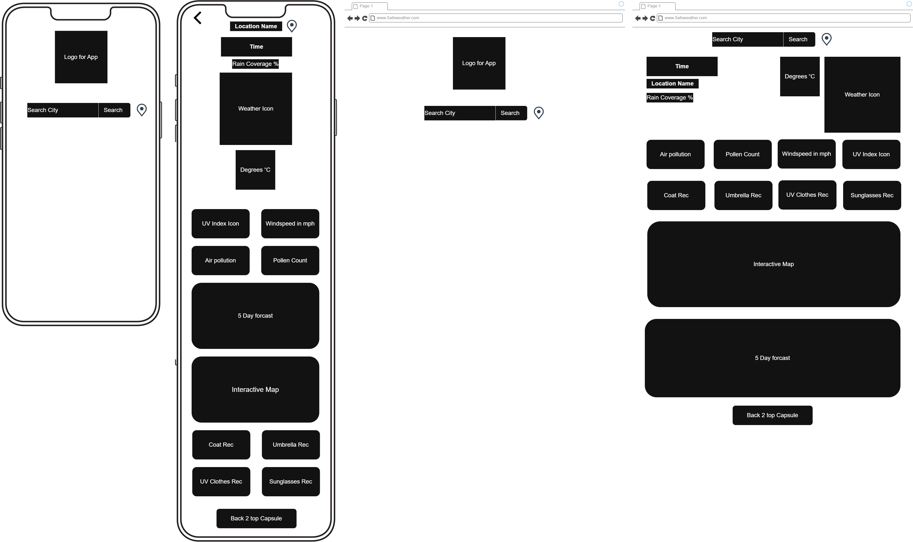
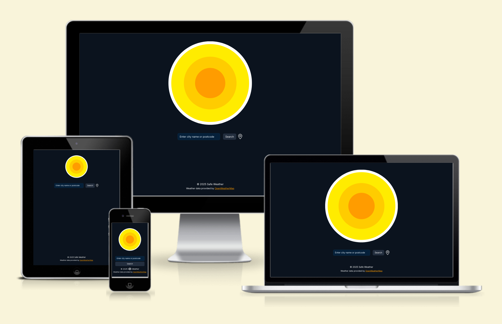

<div align="center">
  
  
  # Safe Weather ☀️🌧️
  
  A real-time weather application that provides intelligent clothing and safety recommendations based on current weather conditions, air quality and UV index.
</div>

## Features

- **Real-time Weather Data** - Current temperature, humidity, wind speed and conditions
- **5-Day Forecast** - Extended weather predictions with daily breakdowns
- **Interactive Map** - Leaflet-powered map to explore weather in different locations
- **Smart Recommendations** - Personalised advice on:
  - Coat/jacket requirements based on temperature
  - Umbrella needs based on precipitation probability
  - Sun protection guidance using UV index
  - Air quality alerts and mask recommendations
- **Location Search** - Find weather by city name, postcode or device location
- **Weather Icons** - Visual representation of current conditions
- **Responsive Design** - Mobile-friendly interface using Bootstrap

## Design

### Wireframes

Initial design concepts and user flow:



### Responsive Views

The application is fully responsive across all device sizes:



## Tech Stack

- **Frontend**: HTML5, CSS3, JavaScript (ES6 modules)
- **Backend**: Proxy server via Netlify serverless function to secure API key
- **Styling**: Bootstrap 5.3.8, custom CSS
- **Mapping**: Leaflet.js 1.9.4
- **Weather API**: OpenWeatherMap
- **Hosting**: GitHub Pages compatible

## Project Structure

```
safeweather/
├── index.html              # Landing page with search
├── weather.html            # Weather details page
├── assets/
│   ├── css/
│   │   └── style.css       # Custom styles
│   ├── images/             # Logo and favicon
│   └── js/
│       ├── weather-data.js           # API calls and data management
│       ├── update-weather-data.js    # DOM updates for weather info
│       ├── update-recomendations.js  # Clothing/safety logic
│       ├── five-day-forecast.js      # Forecast rendering
│       ├── location-search.js        # Search functionality
│       ├── map-init.js               # Leaflet map initialization
│       └── utils/
│           ├── format-date.js        # Date formatting helpers
│           └── weather-icons.js      # Icon mapping
```

## Quick Start

1. Clone the repository:

   ```bash
   git clone https://github.com/niraj-sachania/safeweather.git
   cd safeweather
   ```

2. Start a local server:

   ```bash
   python3 -m http.server
   ```

3. Open your browser to `http://localhost:8000`

## Team

- **Niraj**
- **Rob**
- **Sheena**
- **Louie**
- **Mike**

## Data Sources

Weather data provided by [OpenWeatherMap](https://openweathermap.org/)
